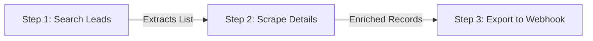

# Workflows

Workflows let you chain multiple Skills together into an end-to-end automated pipeline. Outputs from one step flow seamlessly into subsequent steps — completely eliminating manual glue code.

## Architecture

## Step Output Mapping

You can reference outputs from previous steps using dot-notation:

- `{{step_1.result.items[0].profile_url}}`
- `{{step_2.extracted_data.email}}`

### Example: Lead Enrichment Pipeline

1. **Step 1 (Search Directory)**:
   - Task: *"Search company directory for 'Engineering Managers in New York' and return list of profile URLs."*
2. **Step 2 (Extract Details)**:
   - Input: `{{step_1.result.urls}}`
   - Task: *"For each profile, extract full name, work email, and recent company experience."*
3. **Step 3 (Deliver Payload)**:
   - Sends payload to your configured webhook or database.

<Note>
If any intermediate step encounters an error, Valendata automatically applies configured retry policies before flagging the run.
</Note>
